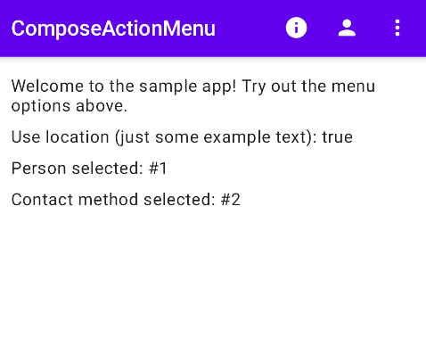
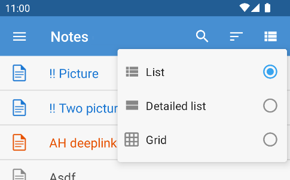

# Compose Action Menu


This multi-platform library provides an easy-to-use action menu for Compose, since Compose doesn't offer this by default.

[]( https://android-arsenal.com/details/1/8261 )

[](https://androidweekly.net/issues/issue-499/)

## Features

- Icons (optional);
- Selectable/checkable items;
- Nested sub menus;
- Automatic overflow for items that don't fit the specified maximum;
- Kotlin Multiplatform (KMP) since version 2, supporting Android, iOS, JVM (desktop) and JS/WASM (since version 3);
- Material 2 & 3 support (since version 3).



# Installation

```kotlin
dependencies {
    implementation("nl.jacobras:compose-action-menu:3.0.0")
}
```

<details>
<summary>Version 3 and newer are built upon Material 3, whereas previous versions use Material 2. Expand this for
migration instructions.</summary>

### Migrating from v2 to v3

Compose Action Menu version 3 is built upon Material 3. The custom colour names have been changed.

2.x:

```kotlin
ActionMenu(
    items = listOf(/* items */),
    colors = DefaultActionMenuColors(
        dropdownIconTint = myContentColor,
        dropdownBackgroundColor = myOverflowContainerColor
    )
)
```

3.x:

```kotlin
ActionMenu(
    items = listOf(/* items */),
    colors = ActionMenuDefaults.colors(
        contentColor = myContentColor,
        overflowContainerColor = myOverflowContainerColor,
        overflowContentColor = myContentColor
    )
)
```

</details>

<details>
<summary>Version 2 and newer are available from Maven Central, whereas previous versions were distributed through JitPack. Expand
this for migration instructions.</summary>

### Migrating from v1 to v2

Compose Action Menu version 2 is built using KMP. Android-specific resource support is replaced with broader string + Painter support.

1.x:

```kotlin
RegularActionItem(
    titleResId = R.string.search,
    iconDrawable = R.drawable.search
)
```

2.x:

```kotlin
RegularActionItem(
    title = stringResource(R.string.search),
    icon = painterResource(R.drawable.search)
)
```

</details>

## Compose version

Each version depends on specific Compose dependencies.

<table>
 <tr>
  <td>
  </td><td>Compose Multiplatform 1.6.11</td>
  <td>Material 3</td>
 </tr>
 <tr>
  <td>
  </td><td>Compose Multiplatform 1.5.1</td>
  <td>Material 2</td>
 </tr>
 <tr>
  <td></td>
  <td>Compose 1.4.3</td>
  <td>Material 2</td>
 </tr>
 <tr>
  <td></td>
  <td>Compose 1.3.3</td>
  <td>Material 2</td>
 </tr>
 <tr>
  <td></td>
  <td>Compose 1.1.0-rc01</td>
  <td>Material 2</td>
 </tr>
</table>

# Usage

```kotlin
val toolbarActions = listOf(
    RegularActionItem(
        key = "search",
        title = stringResource(R.string.search),
        iconVector = Icons.Filled.Search,
        onClick = { /* TODO: Open search screen */ }
    )
)

TopAppBar(
    actions = { ActionMenu(items = toolbarActions) }
)
```

## Supported item types

Several different type of actions can be used. These are all sub classes of `ActionItem`.

- Regular item: `RegularActionItem`;
- Checkable item: `CheckableActionItem`;
- Radio-toggleable item: `RadioActionItem`;
- Groups: `GroupActionItem`.

### Creating a group

Is as simple as:

```kotlin
val subOption1 = RegularActionItem(key = "subOption1", /* ... */)
val subOption2 = RegularActionItem(key = "subOption2", /* ... */)
val subOption3 = RegularActionItem(key = "subOption3", /* ... */)

val group = GroupActionItem(
    key = "myGroup",
    title = stringResource(R.string.group_title),
    childOptions = listOf(subOption1, subOption2, subOption3)
)
```

## Customisation

`ActionMenu` takes some parameters:

- `maxNumberOfIcons` Number of icons to show, including overflow menu icon (if needed);
- `colors` Optional color configuration. Usage: `colors = ActionMenuDefaults.colors(...)`.

`ActionItem`s can be customised too:

- Use `iconVector` or `iconDrawable` to show an icon next to the item's title;
- Set `showAsAction` to change if an item will be shown as an icon or in the overflow menu.

# Testing

Every menu item has a test tag attached to it which is a combination of a `"ActionMenu"` prefix and the item's `key`. Example test usage:

```kotlin
// Menu configuration:
val item = RegularActionItem(key = "myKey", /* ... */)

// Test:
composeTestRule.onNodeWithTag("ActionMenu#myKey").performClick()
```

There's a reserved key for the overflow icon: `"ActionMenu#overflow"`.

# Sample apps

The repository contains two sample apps.

* Run Android: `gradlew sample-app:installDebug`
* Run Desktop: `gradlew sample-desktop:run`

# Production example

My note taking app uses ComposeActionMenu:

<https://play.google.com/store/apps/details?id=nl.jacobras.notes>

